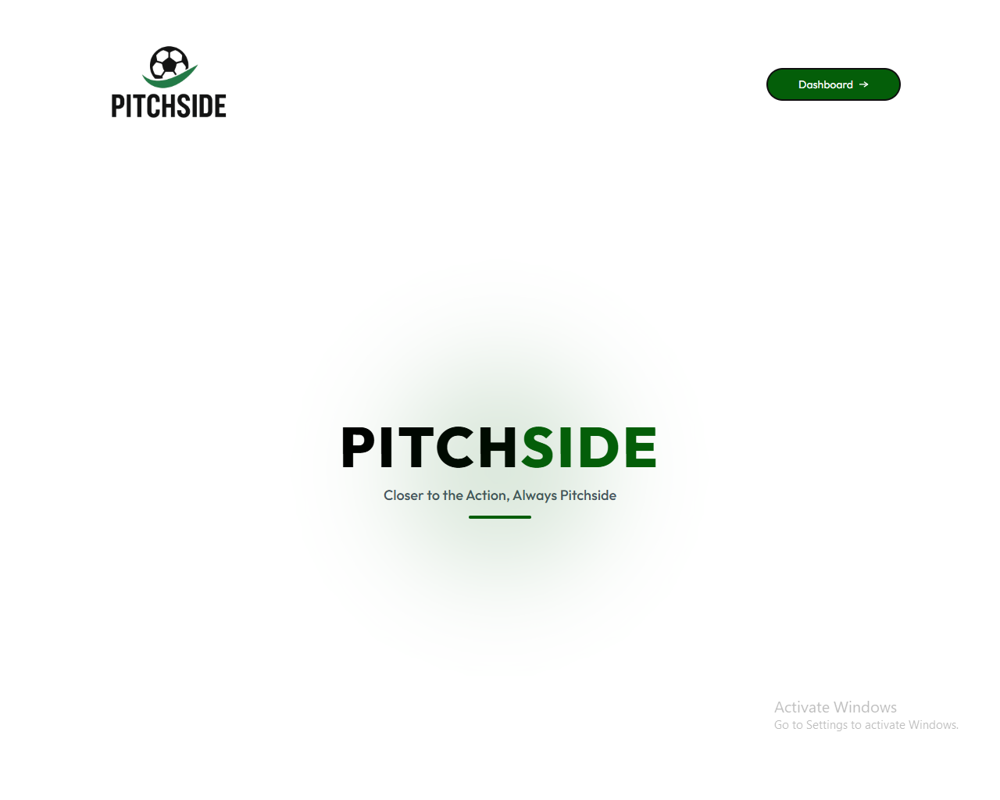
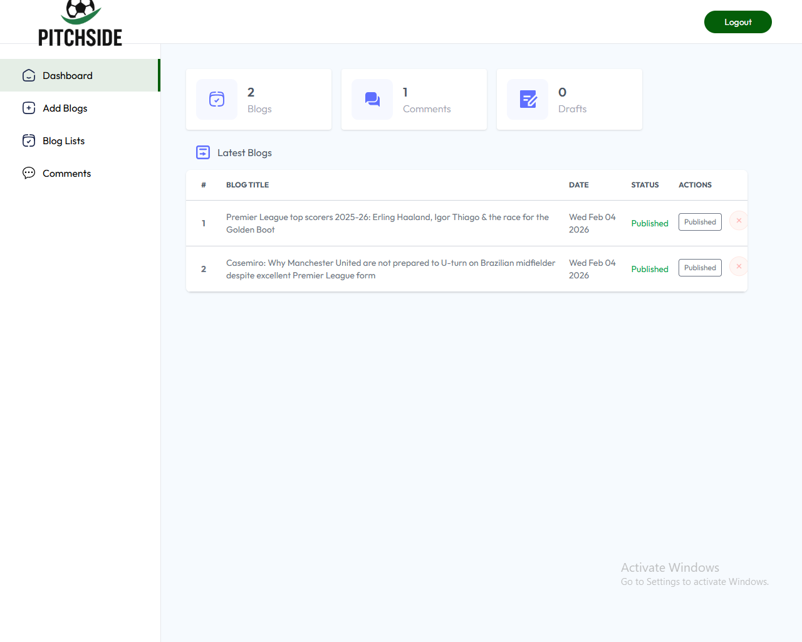
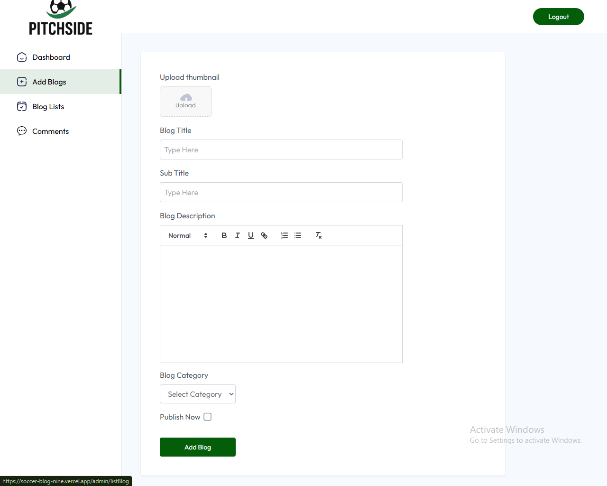

# ⚽ Pitchside – AI-Powered Soccer Content Platform

An AI-powered soccer blogging platform built with the MERN stack that automates article generation while maintaining editorial control through an admin approval workflow.

The platform uses OpenAI to generate football-related content, allowing administrators to review, approve, edit, and publish articles before they become visible to readers.

## Live Demo

Frontend: https://soccer-blog-nine.vercel.app

## 📸 Screenshots

### Landing Page – Article Feed & Navigation UI


### Admin Dashboard – Article Review & Approval System


### AI Article Generation – OpenAI Prompt Workflow


## Overview

Traditional content platforms require writers to manually create articles before publication.

Pitchside streamlines this process by integrating AI-generated content into a controlled publishing workflow where articles can be reviewed and approved before reaching the public.

The application demonstrates full-stack development, API integration, content management workflows, authentication, and scalable backend architecture.

---

## Key Features

### AI-Powered Content Generation

* Generate football articles using OpenAI
* Create content based on prompts and topics
* Automate article drafting

### Admin Approval Workflow

* Review generated articles
* Approve content before publishing
* Reject or edit articles
* Maintain content quality control

### Article Management

* Create articles
* Edit articles
* Delete articles
* Publish approved content

### User Authentication

* Secure login system
* Protected administrative routes
* Session management

### Responsive User Interface

* Mobile-friendly design
* Clean content browsing experience
* Optimized reading layout

---

## Tech Stack

### Frontend

* React
* React Router
* Axios
* CSS

### Backend

* Node.js
* Express.js

### Database

* MongoDB
* Mongoose

### AI Integration

* OpenAI API

### Deployment

* Vercel

---

## System Architecture

```text
User
  ↓
React Frontend
  ↓
Express API
  ↓
MongoDB Database

Admin
  ↓
Generate Article
  ↓
OpenAI API
  ↓
Draft Article Stored
  ↓
Review & Approval
  ↓
Published Content
```

---

## Application Workflow

### Content Generation

1. Admin enters article topic
2. Request sent to backend API
3. Backend communicates with OpenAI
4. AI-generated content is returned
5. Draft stored in MongoDB

### Editorial Review

1. Draft appears in admin dashboard
2. Admin reviews generated content
3. Article is edited if required
4. Article is approved or rejected

### Publishing

1. Approved articles become publicly available
2. Readers can browse published content
3. Published articles remain manageable through the dashboard

---

## Technical Challenges Solved

### AI Content Workflow Management

Implemented a controlled workflow to ensure AI-generated content is reviewed before publication.

### API Integration

Integrated OpenAI APIs into the backend while handling asynchronous responses and content generation requests.

### Content Moderation

Created an approval process that separates draft content from published content.

### Full-Stack Data Flow

Built end-to-end communication between React, Express, MongoDB, and OpenAI services.

---

## Project Structure

```text
soccer-blog/
│
├── blog/
│   ├── src/
│   ├── components/
│   ├── pages/
│   └── services/
│
├── server/
│   ├── controllers/
│   ├── routes/
│   ├── models/
│   ├── middleware/
│   └── config/
│
└── README.md
```

---

## Installation

### Clone Repository

```bash
git clone https://github.com/coffee-driven-dev007/soccer-blog.git
```

### Install Dependencies

Frontend

```bash
cd blog
npm install
```

Backend

```bash
cd server
npm install
```

### Environment Variables

Create a `.env` file in the server directory.

```env
PORT=5000
MONGO_URI=your_mongodb_connection
OPENAI_API_KEY=your_openai_api_key
JWT_SECRET=your_secret_key
```

### Run Backend

```bash
npm run dev
```

### Run Frontend

```bash
npm start
```

---

## Future Improvements

* Role-based access control
* Scheduled article publishing
* AI-assisted article editing
* Comment system
* Article analytics dashboard
* Category and tag management
* Search functionality
* Rich text editor

---

## Lessons Learned

This project reinforced the importance of:

* Building reliable API integrations
* Managing asynchronous workflows
* Designing approval processes for AI-generated content
* Structuring scalable MERN applications
* Connecting frontend, backend, database, and external services into a single workflow

---

## Author

James Matsheni

Full-Stack Developer

Tech Stack:
React • Node.js • Express • MongoDB • OpenAI

Open to Full-Stack Developer opportunities.
